# Projeto 'Nictofobia'

# Descrição Resumida do Projeto/Jogo

O projeto é um jogo celular onde o jogador se encontra em uma caverna escura com apenas uma tocha que vai se apagando. A escuridão é perigosa, e a caverna está lotada de monstros, baús e gravetos que podem virar tochas. O jogador pode coletar recursos, batalhar com monstros ou fugir deles, e seu objetivo é sair da caverna vivo.

# Equipe
* Elias Santos Martins - 247057
* Gabriel Sanders Pereira Sobral - 247118

# Arquivo Executável do Jogo

[Arquivo JAR](https://drive.google.com/file/d/1S9cACZ-sS0ul9WTPu7YXQKtS0VLTWt6X/view?usp=sharing)

# Slides do Projeto

## Slides da Prévia
[Slides](https://drive.google.com/file/d/14FVyU6uTYqqIJiO0VbpYSVwQkQQt--oc/view?usp=sharing)

## Slides da Apresentação Final
[Slides](https://docs.google.com/presentation/d/1APJYX9cu8l4tpm9bBZRFFNDrj554BkNwClB65h1eNm4/edit?usp=sharing)

## Relatório de Evolução
Começamos o projeto definindo os componentes principais e a ordem dos serviços. Tivemos dificuldade em decidir uma ordem para começar a implementação, e acreditamos que isso se deve a falta de um planejamento maior de como funcionaria a comunicação entre componentes. Para a implementação, começamos implementando a interface gráfica com algumas texturas simples, e fizemos apenas o necessário do model para o gráfico funcionar. Essa decisão foi tomada pois facilita a vizualização do estado atual do projeto, inclusão de novos componentes e mecânicas, aumento da complexidade e revisões na arquitetura, pois o projeto é colocado para executar desde o princípio. Após isso nos concentramos em ler a entrada do jogador e construir os componentes Caverna, Célula e Ator (somente a classe abstrata) e realizar suas conexões. Nisto podemos realizar mudanças que seriam muito difíceis se fossem deixadas para mais tarde. 
Por exemplo, tivemos a ideia inicial de a célula representar seus atores fazendo separação entre atores vivos e atores objeto, como abaixo:
~~~java
public class Celula implements ICelula {
	private Map<String, IAtorVivo> atoresVivos;
	private Map<String, IAtorObjeto> atoresObjeto;
	...
}
~~~
Isso dificultaria o código, pois toda vez que fosse solicitado uma operação sobre os atores deveria ser informado se era um ator vivo ou ator objeto. O uso de um Map também era desnecessário, ja que a célula dificilmente terá mais de 2 ou 3 atores dentro de si. Com isso, mantemos a ideia de atores vivos e atores objeto como algo interno do componente Ator, e deixamos as interações com a caverna na interface IAtor
~~~java
public class Celula implements ICelula {
	private ArrayList<IAtor> atores;
	...
}
~~~
Outra mudança importante foi mudar a forma de comunicação entre o caverna e o viewCaverna. Antes, cada célula era conectada com um viewCélula, e quando a célula sofria uma mudança, avisava o viewCélula da mudança, que então solicitava os atributos da célula. Isso gerava uma conexão dupla que consideramos desnecessária, e alteramos para que o viewCélula que seja conectado a Celula, e solicite seu estado somente na hora de imprimir na tela
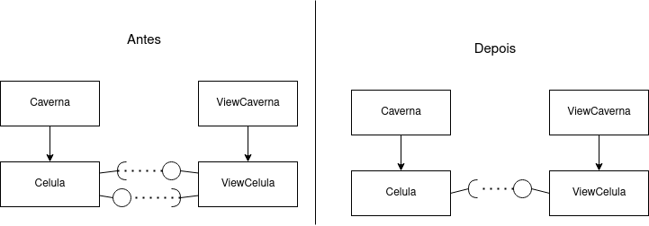
Com isso pronto, decidimos nos focar no controle do jogo. Devido as facilidades oferecidas pelo libGDX de ter o método render() que é chamado periodicamente, mudamos o plano do jogo só agir quando uma ação é feita pelo jogador para um jogo que age por tempo, o que melhora a jogabilidade. Após isso focamos na implementação da luminosidade diferente em cada célula, com áreas escuras e claras, o que foi a parte mais difícil de implementar. Por fim, construímos a hierarquia complexa da classe Ator e o componente Inventario, e, com tudo funcionando, pudemos implementar os outros atores, inimigos, itens e o fim do jogo. Por último, implementamos o sistema de exceções.
As lições aprendidas foram: não subestimar a arquitetura, pois muito tempo foi perdido refazendo código devido a mudanças que não seriam necessárias caso tivéssemos planejado melhor; ter uma visão clara de qual o objetivo que queremos e a dificuldade dele, pois durante o desenvolvimento não havia um alvo claro de como seria o jogo finalizado; realizar a implementação das exceções mais cedo, pois como tardamos muito nisso a dificuldade foi grande, devido a ter de investigar milhares de linhas de código pronto para verificar onde poderiam surgir erros; e melhorar a comunicação e o trabalho em equipe.

# Destaques de Código
## Destaque 1 - Administração de rodadas da caverna
Por eficiência, a caverna só avisa que uma rodada passou para atores em um raio de 16 do herói, e faz isso considerando as velocidades de cada um, do maior pro menor.
~~~java
public class Caverna implements ICaverna {
	private PriorityQueue<IAtor> pq;
	private int raioRodada;

   public void passarRodada() {
		int x = heroi.getX(), y = heroi.getY();
		
		for (int i = x - raioRodada; i <= x + raioRodada; i++) {
			for (int j = y - raioRodada; j <= y + raioRodada; j++) {
				if (verificaValidade(i ,j)) {
					atores = celulas[i][j].getAtores();
					for (IAtor ator : atores) {
						pq.add(ator);
		...
      while (!pq.isEmpty())
            pq.poll().passarRodada();
   }
}
~~~

## Destaque 2 - Câmera seguindo o jogador
O componente viewCaverna possui uma matriz de células onde cada célula está conectada a célula correspondente na caverna. Para manter o jogador sempre centralizado, é armazenado as coordenadas de qual deve ser a célula na esquerda inferior da tela em coordXPlot e coordYPlot. A cada vez que a tela é impressa, essa posição é atualizada pelo método atualizarCelulaImpressao, caso o herói esteja muito perto ou muito longe na direção x ou y, e com isso, o método plotarCelulas utiliza essa célula como referência, e a impressão é de a câmera seguir o jogador.

~~~java
public class ViewCaverna implements IViewCaverna {
	private int coordXPlot, coordYPlot;

	private void atualizarCelulaImpressao() {
			...
			if (xHeroi - coordXPlot < celulasX / 3)
				coordXPlot = xHeroi - celulasX / 3;
			else if (xHeroi - coordXPlot > 2 * celulasX / 3)
				coordXPlot = xHeroi - 2 * celulasX / 3;
			
			if (yHeroi - coordYPlot < celulasY / 3)
				coordYPlot = yHeroi - celulasY / 3;
			
			else if (yHeroi - coordYPlot > 2 * celulasY / 3)
				coordYPlot = yHeroi - 2 * celulasY / 3;
		}

	private void plotarCelulas(SpriteBatch batch) {
			atualizarCelulaImpressao();
			
			for (int i = coordXPlot; i < coordXPlot + celulasX; i++)
				for (int j = coordYPlot; j < coordYPlot + celulasY; j++)
					...
						viewCelulas[i][j].plotar(...);
	}
}
~~~

## Destaque 3 - Busca em largura
Como temos atores sólidos que bloqueiam a passagem em suas células, a classe AtorVivo fornece um método de busca do menor caminho em uma caverna, onde
é informado a distância máxima desejada do destino (xDest, yDest) e a profundidade máxima da busca. Esse método retornará o primeiro movimento que deve ser feito. Não é necessário o caminho inteiro já que, devido aos atores vivos, esse caminho pode mudar a cada rodada. O algoritmo usado é uma busca em largura (BFS), e também é usado uma classe auxiliar Caminho, que ajuda no código.
~~~java
public class Caminho {
	char movimentoInicio;
	int tamanho;
	int xAtual, yAtual;
	...
}

public char buscarCaminho(int xAtual, int yAtual, int xDest, int yDest, int maxProfundidade, int distancia) {
		...
		Queue<Caminho> caminhos = new LinkedList<Caminho>();
		
		caminhos.add(new Caminho(xAtual, yAtual));
		
		while (!caminhos.isEmpty()) {
			caminho = caminhos.poll();
			xCam = caminho.getX();
			yCam = caminho.getY();
			
			if (cave.distanciaQuadrado(xCam, yCam, xDest, yDest) < distancia * distancia) {
				caminhoResposta = caminho.getPrimeiroMove();
				break;
			}
			else if (caminho.getTamanho() < maxProfundidade) {
				if (cave.entravel(xCam, yCam + 1)) {
					cloneCaminho = caminho.clone();
					cloneCaminho.inserirMovimento('w');
					caminhos.add(cloneCaminho);
				}
				... // adiciona os proximos caminhos possiveis na fila
		}
		
		return caminhoResposta;
	}
~~~

# Destaques de Orientação a Objetos

## Destaque 1 - Hierarquia do componente ator
Destacamos a hierarquia de classes abstratas componente ator, que faz grande uso do polimorfismo e herança para administrar os comportamentos de cada ator diferente na caverna. A classe Ator define o comportamento comum de todos os atores e de suas interações com a caverna. A classe AtorAtaque define o comportamento dos ataques e alertas gerados pelos atores, controlando a duração, a aplicação do dano. A classe AtorObjeto define o comportamento dos objetos como parede, lava, pedra, que não interagem. A classe AtorVivo define o comportamento de atores vivos, administrando vida, ataque, defesa, quantidade de rodadas pra se mover e atacar, oferece métodos de movimento e busca de caminhos. Por fim, a classe AtorInimigo define o comportamento dos inimigos, sobreescrevendo passarRodada() para eles perseguirem o herói e controlando o sistema de dropar itens quando morrem. Isso tudo permite a fácil inserção de novos atores, basta fazê-los herdeiros da classe abstrata correta e definir neles somente comportamentos específicos, usando sobrecarga de métodos presentes nas classes abstratas.

### Diagrama de Classes usada no destaque OO:
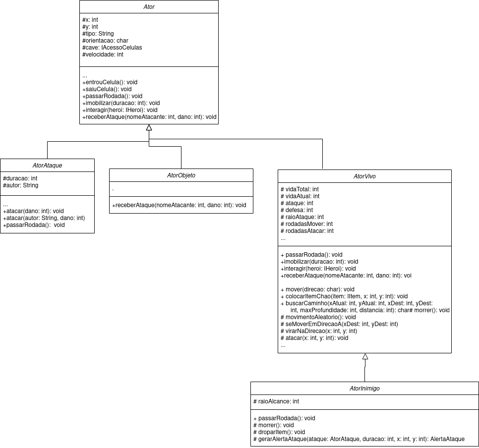

### Código do Destaque OO
Para exemplificar a utilidade da hierarquia, vamos tomar o código do inimigo aranha. Ele precisa apenas definir valores para os atributos e escrever seus comportamentos específicos, que são a forma de ataque (sobrecarga método atacar()), a forma de dropar itens (sobrecarga método droparItem()) e seus ataques especiais (pocaVenenosa e lancarTeia).
~~~java
public class Aranha extends AtorInimigo {
	private int countPocaVenenosa, countTeia;
	
	public Aranha() {
		super();
		this.ataque = 12;
		... // define os atributos
	}
	
	
	private void pocaVenenosa(int x, int y) {
		...
	}
	
	
	private void lancarTeia(int x, int y) {
		...
	}

	@Override
	public void atacar(int x, int y) {
		...
      int ale = aleatorio.nextInt(100);
      if (countPocaVenenosa == 0 && ale <= 30) 
         pocaVenenosa(x, y);
      else if (countTeia == 0 && ale >= 30 && ale <= 50) 
         lancarTeia(x, y);
      else if (cave.distanciaQuadrado(x, y, this.x, this.y) < 4)
         super.atacar(x, y);
      else if (podeMover()) {
         seMoverEmDirecaoA(x, y);
		...
	}
	
	
	@Override
	public void passarRodada() {
		super.passarRodada();
		if (countPocaVenenosa > 0)
			countPocaVenenosa--;
		...
	}

	@Override
	protected void droparItem() {
		... // define um item aleatório
		
		if (item != null)
			colocarItemChao(item, this.x, this.y);
	}
}
~~~

Tomando como segundo exemplo a saída da caverna, ela precisa apenas definir sua interação com o herói e iluminar células ao seu redor quando entra.
~~~java
public class Saida extends AtorObjeto {
	public Saida() {
		this.solido = true;
		this.orientacao = 's';
		this.tipo = "saida";
	}
	
	
	@Override
	public void entrouCelula() {
		cave.iluminarCelulas(x, y, 3);
	}
	
	@Override
	public void interagir(IHeroi heroi) {
		heroi.ganhar();
	}
}
~~~
Entre outros.

## Destaque 2 - método passarRodada
O comportamento de cada ator ou item é definido no que ele faz ao passar uma rodada. Todos os atores, itens e a prórpia caverna tem esse método, o que simplifica a chamada e explora o polimorfismo. Cada objeto define dentro de si seu comportamento. A caverna avisa os atores que a rodada passou, os inimigos vão tentar perseguir e atacar o herói, o herói vai realizar o comando do jogador e avisar seus itens que a rodada passou, a tocha vai se apagar um pouco, pedras e paredes não irão fazer nada, etc.

### Diagrama do destaque OO
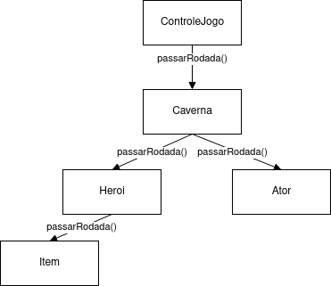
### Código do destaque OO
Exemplo na classe atorInimigo, os inimigos tem o comportamento de perseguir o herói
~~~java
public abstract class AtorInimigo extends AtorVivo {
   public void passarRodada() {
		int xHeroi = cave.getXHeroi(), yHeroi = cave.getYHeroi();
		...
			if (distanciaAoHeroi <= raioAtaque * raioAtaque + 1)
				atacar(xHeroi, yHeroi);
			
			else if (podeMover() && distanciaAoHeroi >= raioAtaque * raioAtaque &&
					distanciaAoHeroi <= raioAlcance * raioAlcance)
				seMoverEmDirecaoA(xHeroi, yHeroi);
			
			else if (podeMover() && aleatorio.nextInt(100) <= 20)
					movimentoAleatorio();
			}
      ...
}
~~~
No herói, ele tenta realizar seu comando e avisa seu item
~~~java
public class Heroi extends AtorVivo implements IHeroi {
   public void passarRodada() {
		super.passarRodada();
		realizarComando(comandoAtual);
      if (itemSelecionado != null)
			itemSelecionado.passarRodada();
		...
	}
}
~~~
A tocha é apagada um pouco, e se sua luz apagar ela some
~~~java
public class Tocha extends Item {
   public void passarRodada() {
		luz--;
		if (luz == 0)
			inventario.removerItem(this);
		...
	}
}
~~~
Por fim, cada ator define seu comportamento através desse método

## Destaque 3 - Ataque como ator
A realização de ataque entre atores no jogo é feita criando um objeto AtorAtaque e o colocando na caverna. Esse objeto, quando entra em uma célula, aplica seu efeito a todos os outros atores presentes na célula. Isso faz com que seja fácil programar diferentes tipos de ataque, e facilita a integração com a interface gráfica

### Código do destaque OO
O ataque é dado colocando um objeto ataque na célula alvo, esse objeto quando entra na célula causa dano a todos seus atores
~~~java
public abstract class AtorVivo extends Ator {
	protected void atacar(int x, int y) {
			if (podeAtacar()) {
				AtaquePadrao objAtaque = new AtaquePadrao();
				...
				objAtaque.connect(cave);
				...
			}
	}
}

public class AtaquePadrao extends AtorAtaque {
	public void entrouCelula() {
		atacar(dano);
	}
}

public abstract class AtorAtaque extends Ator {
	public void atacar(int dano) {
		IAcoesAtor[] atores = cave.getAtores(x, y);
		
		if (atores != null) {
			for (IAcoesAtor ator : atores) {
				ator.receberAtaque(autor, dano);
	...
}
~~~
Isso também é usado no alerta de ataque que aparece em vermelho no chão, que é um objeto que leva outro objeto AtorAtaque dentro de si. Quando o tempo do alerta termina, ele sai da célula e coloca o ataque que está levando dentro de si.
~~~java
public class AlertaAtaque extends AtorAtaque {
	private AtorAtaque ataque;
	
	public void saiuCelula() {
		...
		ataque.connect(cave);
	}
}
~~~

# Destaques de Pattern

## Destaque 1 - facade
O componente ControleJogo implementa o pattern facade, ao ter métodos simples como iniciarJogo, passarRodada, heroiGanhou, heroiPerdeu, através da interface IControleJogo. 

### Diagrama do Pattern
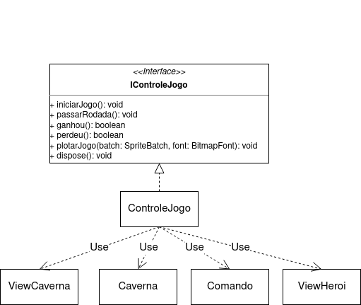

### Código do Pattern
Interface com comandos gerais
~~~java
public interface IControleJogo {
	public void iniciarJogo() throws ArquivoAusente, ArquivoMalFormatado;
	public void passarRodada();
	public void plotarJogo(SpriteBatch batch, BitmapFont font);
	public boolean perdeu();
	public boolean ganhou();
	public void dispose();
}
~~~
Os métodos usam vários componentes para realizar a tarefa
~~~java
public class ControleJogo implements IControleJogo {
   private IComando leitorComandos;
	private IViewCaverna viewCave;
   private IViewHeroi viewHeroi;
   private ICaverna cave;
   ...
   
	public void passarRodada() {
		leitorComandos.lerComando();
		cave.passarRodada();
	}

	public void plotarJogo(SpriteBatch batch, BitmapFont font) {
		viewCave.plotarCaverna(batch, font);
		viewHeroi.plotarHeroi(batch, font);
	}
}
~~~
O pattern faz isso reunindo vários componentes atrás de si e escondendo sua complexidade, de modo que todas as chamadas necessárias para controlar o estado do jogo são feitas por meio dele. As vantagens disso são que é fácil controlar o fluxo de acontecimentos do jogo e a adaptabilidade, ja que por trás do facade pode se ter qualquer jogo baseado em turnos em uma caverna, onde o jogador pode ganhar e perder, ou seja, o código que chama o pattern não precisa saber detalhes sobre qual é o jogo.

## Destaque 2 - Singleton
Usamos o pattern singleton para evitar duplicidades em componentes que precisam somente de uma instância, como ControleJogo e Montador
### Código do pattern
~~~java
public class Montador implements IMontador {
	private static final Montador instance = new Montador();
	
	private Montador() {
		...
	}
	
	
	public static Montador getInstance() {
		return instance;
	}
}
~~~
O componente deixa seu construtor privado, de modo que ninguém possa instanciá-lo, e oferece sua instância através de getInstance.

## Destaque 3 - Builder
O componente ControleJogo é responsável por instanciar e conectar todos os demais, implementando a ideia de um builder.
### Código do pattern
~~~java
public class ControleJogo implements IControleJogo {
	public void iniciarJogo() throws ArquivoAusente, ArquivoMalFormatado {
		criarViewCaverna();
		criarViewHeroi();
		iniciarModel();
		leitorComandos = new Comando();
		conectarComponentes();
	}
}
~~~

# Conclusões e Trabalhos Futuros
Concluímos que o planejamento de uma boa arquitetura e sua correta implementação é fundamental para criar sistemas complexos, como o nosso jogo, que o encapsulamento é necessário para o controle de complexidade, pois se não tivéssemos separado o jogo em componentes provavelmente teríamos nos perdido no meio do código, e que isso também auxilia na colaboração e trabalho em equipe, já que podemos dividir a implementação dos componentes entre as pessoas, de modo que elas tem apenas que implementar corretamente os métodos definidos nas interfaces. Uma melhoria que poderia ser feita é uma mudança de arquitetura, onde cada componente Ator seja conectado com um componente ViewAtor, responsável pela vizualização, o que tornaria possível incluir na interface gráfica barras de vida e animações, e no geral facilitaria a representação dos atores, tirando parte da responsabilidade do componente ViewCaverna, que ficou bem complexo. Poderíamos também implementar o pattern Factory para instanciar os componentes Ator, implementar o pattern Observer para as coordenadas do herói, de modo que o subject seriam as coordenadas do herói, e os Observers os componentes que precisam dessas coordenadas (A caverna, o ViewCaverna e os atores inimigos). O pattern Observer também poderia ser implementado com um timer como subject e todos os componentes que possuem passarRodada() como observers. Por fim, poderíamos melhorar nosso sistema de exceções, fazendo o programa poder lidar com certas exceções e não simplismente parar a execução. 

# Documentação dos Componentes

O vídeo a seguir apresenta um detalhamento de um projeto baseado em componentes:

# Diagramas

## Diagrama Geral da Arquitetura do Jogo

### Arquitetura dos componentes quando o jogo inicia

Esse é o diagrama do início do jogo. o ViewJogo solicitará ao componente ControleJogo(facade) que o jogo se inicie. O ControleJogo solicitará ao Montador que construa a Caverna com seus Atores. O Montador instancia os atores e os conecta a Caverna. Quando um Ator é conectado a Caverna ele solicita sua inserção na Célula correta. O Montador utiliza o componente Leitor para ler a localização dos atores do arquivo cave.txt. Quando o Ator Heroi é criado, ele cria seu Inventario.
O ControleJogo também cria o componente ViewHeroi e o ViewCaverna. O ViewCaverna, quando é criado, utiliza o componente Leitor para ler as localizações das texturas do arquivo textures.txt, e carrega essas texturas no jogo, que estão localizadas na pasta assets. Por último, o ControleJogo executa as conexões necessárias.
### Arquitetura dos componentes quando o jogo está rodando

Este é o diagrama de execução do jogo. O ViewJogo avisará ao ControleJogo que uma rodada se passou. O ControleJogo avisará o Comando, que lerá a entrada do jogador e a passará ao Heroi. Após isso, o ControleJogo avisará a Caverna, que avisará todos os seus Atores, com cada Ator definindo o que fará. Os Atores podem solicitar a Caverna acesso aos outros Atores para poder interagir diretamente com eles. Finalmente, o ControleJogo avisará o ViewCaverna, que usará os dados da Caverna para imprimir na tela seu estado, e o ViewHeroi, que usará os dados do Heroi e do seu Inventario para imprimir na tela seu estado.

## Diagrama Geral de Componentes

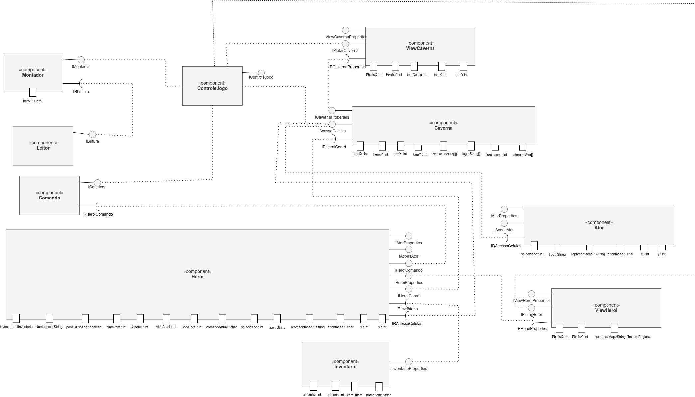
* Algumas linhas saem do ControleJogo sem interfaces pois ele é quem instancia o componente.
## Componente `Comando`

Responsável por ler a entrada do jogador e a passar para o herói. Oferece o serviço de ler uma tecla do teclado e a passar ao componente herói, e de consultar se o herói ganhou ou perdeu o jogo.

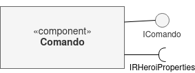

**Ficha Técnica**
item | detalhamento
----- | -----
Classe | `src.pt.controller.comando`   
Autores | `Elias Santos Martins`
Interfaces | `IComando, IRHeroiComando`

### Interfaces

Interfaces associadas a esse componente:

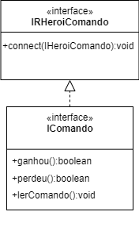

Interface agregadora do componente em Java:

~~~java
public interface IComando extends IRHeroiComando {
	public void lerComando();
	public boolean ganhou();
	public boolean perdeu();
}
~~~

## Componente `Controle`

Responsável por iniciar e controlar o jogo, funciona como um facade e um builder

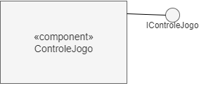

**Ficha Técnica**
item | detalhamento
----- | -----
Classe | `src.pt.controller.controle`   
Autores | `Elias Santos Martins`
Interfaces | `IControleJogo`

### Interfaces

Interfaces associadas a esse componente:

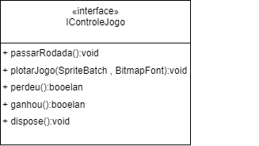

Interface agregadora do componente em Java:

~~~java
public interface IControleJogo {
	public void iniciarJogo() throws ArquivoAusente, ArquivoMalFormatado;
	public void passarRodada();
	public void plotarJogo(SpriteBatch batch, BitmapFont font);
	public boolean perdeu();
	public boolean ganhou();
	public void dispose();
}
~~~

## Componente `Leitor`

Responsável por ler dados de arquivos de texto.

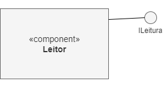

**Ficha Técnica**
item | detalhamento
----- | -----
Classe | `src.pt.controller.leitor`   
Autores | `Gabriel Sanders Pereira Sobral`
Interfaces | `ILeitor, ILeitura`

### Interfaces

Interfaces associadas a esse componente:

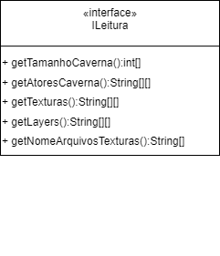

Interface agregadora do componente em Java:

~~~java
public interface ILeitor extends ILeitura {
	
}
~~~

## Componente `Montador`

Responsável por criar a caverna, instanciar os componentes ator presentes nela e os conectá-los a caverna, e armazenar o herói durante essa criação

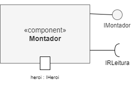

**Ficha Técnica**
item | detalhamento
----- | -----
Classe | `src.pt.controller.montador`   
Autores | `Elias Santos Martins`
Interfaces | `IMontador, IRLeitura`

### Interfaces

Interfaces associadas a esse componente:

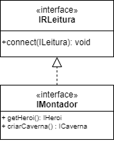

Interface agregadora do componente em Java:

~~~java
public interface IMontador extends IRLeitura {
	public ICaverna criarCaverna() throws ArquivoAusente, ArquivoMalFormatado;
	public IHeroi getHeroi();
}
~~~

## Componente `Ator`

Responsável por representar um ator do jogo e administrar suas interações com outros atores e com as células

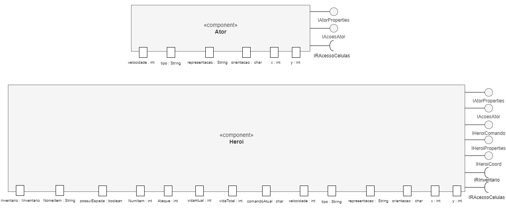

**Ficha Técnica**
item | detalhamento
----- | -----
Classe | `src.pt.model.ator`   
Autores | `Elias Santos Martins`
Interfaces | `IAtor, IAtorProperties, IRAcessoCelulas ,IAcoesAtor`

### Interfaces

Interfaces associadas a esse componente:

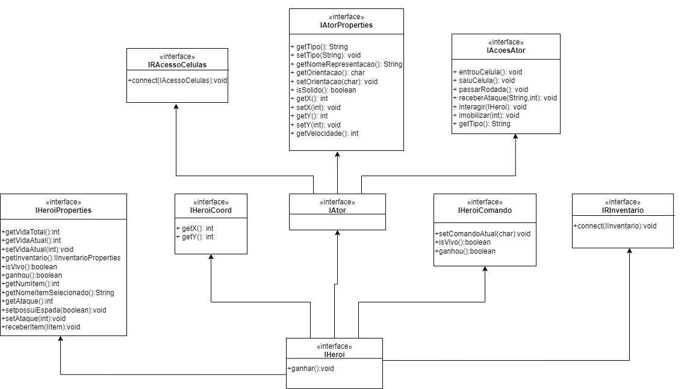

Interface agregadora do componente em Java:

~~~java
public interface IAtor extends IAtorProperties, IRAcessoCelulas
		, IAcoesAtor {

}
~~~

## Componente `Heroi`

Responsável por representar o herói do jogo, administrar os itens e receber comandos

**Ficha Técnica**
item | detalhamento
----- | -----
Classe | `src.pt.model.ator`   
Autores | `Elias Santos Martins`
Interfaces | `IHeroi, IAtor, IHeroiCoord, IHeroiProperties, IRInventario, IHeroiComando`

### Interfaces

Interface agregadora do componente em Java:

~~~java
public interface IHeroi extends IAtor, IHeroiCoord, IHeroiProperties, IRInventario, IHeroiComando {
	public void ganhar();
}
~~~

## Componente `Caverna`

Responsável por controlar e coordenar as células, oferecer acesso as células e aos atores presentes nela, administrar a validade dos movimentos e localizar o herói nas células.

**Ficha Técnica**
item | detalhamento
----- | -----
Classe | `src.pt.model.caverna`   
Autores | `Elias Santos Martins e Gabriel Sanders Pereira Sobral`
Interfaces | `ICaverna ICavernaProperties, IAcessoCelulas,IRHeroiCoord`

### Interfaces

Interfaces associadas a esse componente:

Interface agregadora do componente em Java:

~~~java
public interface ICaverna extends ICavernaProperties, IAcessoCelulas, IRHeroiCoord{
	
}
~~~

## Componente `Celula`

Responsável por representar uma célula, armazenar os atores e controlar a entrada e saída dos atores, verificando se são válidas

**Ficha Técnica**
item | detalhamento
----- | -----
Classe | `src.pt.model.caverna`   
Autores | `Elias Santos Martins`
Interfaces | `ICelula, ICelulaProperties`

### Interfaces

Interfaces associadas a esse componente:

Interface agregadora do componente em Java:

~~~java
public interface ICelula extends ICelulaProperties{

}
~~~

## Componente `Inventario`

Responsável por administrar um inventario de componentes Item e suas interações com o herói e o sitema de células

**Ficha Técnica**
item | detalhamento
----- | -----
Classe | `src.pt.model.inventario`   
Autores | `Elias Santos Martins e Gabriel Sanders Pereira Sobral`
Interfaces | `IInventario, IInventarioProperties, IAcessoItens, IRHeroi, IRAcessoCelulas`

### Interfaces

Interfaces associadas a esse componente:

Interface agregadora do componente em Java:

~~~java
public interface IInventario extends IInventarioProperties, IAcessoItens, IRHeroi, IRAcessoCelulas {

}
~~~

## Componente `Item`

Responsável por representar um item do jogo

**Ficha Técnica**
item | detalhamento
----- | -----
Classe | `src.pt.model.inventario`   
Autores | `Elias Santos Martins e Gabriel Sanders Pereira Sobral`
Interfaces | `IItem, IRHeroi, IRAcessoCelulas`

## Componente `viewCaverna`

Responsável por mostrar na tela o estado atual da caverna e seus atores.

**Ficha Técnica**
item | detalhamento
----- | -----
Classe | `src.pt.view.viewCaverna`   
Autores | `Elias Santos Martins e Gabriel Sanders Pereira Sobral`
Interfaces | `IViewCaverna, IViewCavernaProperties, IPlotarCaverna, IRCavernaProperties`

### Interfaces

Interfaces associadas a esse componente:

Interface agregadora do componente em Java:

~~~java
public interface IViewCaverna extends IViewCavernaProperties, IPlotarCaverna, IRCavernaProperties {
	public void create() throws ArquivoAusente, ArquivoMalFormatado;
}
~~~

## Componente `viewHeroi`

Responsável por mostrar na tela o estado atual do herói, de sua vida e seu inventário

**Ficha Técnica**
item | detalhamento
----- | -----
Classe | `src.pt.view.viewHeroi`   
Autores | `Elias Santos Martins`
Interfaces | `IViewHeroi, IViewHeroiProperties, IPlotarHeroi, IRHeroiProperties`

### Interfaces

Interfaces associadas a esse componente:

Interface agregadora do componente em Java:

~~~java
public interface IViewHeroi extends IViewHeroiProperties, IPlotarHeroi, IRHeroiProperties {

}
~~~

## Componente `ViewJogo`

Responsável pela vizualização, por iniciar e por terminar o jogo. A função main chama primeiro esse componente

**Ficha Técnica**
item | detalhamento
----- | -----
Classe | `src.pt.controller.comando`   
Autores | `Elias Santos Martins`
Interfaces | ``

## Detalhamento das Interfaces

### Interface `IComando`

Interface provida por componentes que fornecam a leitura de comandos e consulta se o herói ganhou ou perdeu.

~~~java
public interface IComando extends IRHeroiComando {
	public void lerComando();
	public boolean ganhou();
	public boolean perdeu();
}
~~~

Método | Objetivo
-------| --------
`lerComando`| Faz a leitura de um comando da entrada e o passa ao componente herói
`ganhou`| Retorna se o herói ganhou o jogo
`perdeu`| Retorna se o herói perdeu o jogo

### Interface `IRHeroiComando`

Interface requerida de um componente que possa receber os comandos de entrada através da interface `IHeroiComando`.

~~~java
public interface IRHeroiComando {
	public void connect(IHeroiComando jogador);
}
~~~

Método | Objetivo
-------| --------
`connect`| Conecta o componente a outro que possa receber os comandos, informado através do parâmetro `jogador`.

### Interface `IControleJogo`

Interface provida por componentes que fornecam a iniciação e controle de um jogo baseado em rodadas

~~~java
public interface IControleJogo {
	public void iniciarJogo() throws ArquivoAusente, ArquivoMalFormatado;
	public void passarRodada();
	public void plotarJogo(SpriteBatch batch, BitmapFont font);
	public boolean perdeu();
	public boolean ganhou();
	public void dispose();
}
~~~

Método | Objetivo
-------| --------
`iniciarJogo`| Inicia o jogo, instanciando todos os componentes necessários para o seu funcionamento
`passarRodada`| Passa uma rodada no espaço do jogo, avisando todos os componentes
`plotarJogo`| Recebe os objetos do libGDX de interface gráfica `batch` e `font` e os utiliza para mostrar na tela o estado atual do jogo
`perdeu`| Retorna se o jogo está ganho
`ganhou`| Retorna se o jogo está perdido
`dispose`| Libera a memória de objetos do libGDX usados pelo jogo

### Interface `ILeitura`

Interface provida por componentes que fornecam a leitura de dados sobre a caverna e as texturas de arquivos de texto

~~~java
public interface ILeitura {
	public int[] getTamanhoCaverna() throws ArquivoAusente, ArquivoMalFormatado;
	public String[][] getAtoresCaverna() throws ArquivoAusente, ArquivoMalFormatado;
	public String[][] getTexturas() throws ArquivoAusente, ArquivoMalFormatado;
	public String[][] getLayers() throws ArquivoAusente, ArquivoMalFormatado;
	public String[] getNomeArquivosTexturas() throws ArquivoAusente, ArquivoMalFormatado;
}
~~~

Método | Objetivo
-------| --------
`getTamanhoCaverna`| Faz a leitura e retorna um vetor de 2 posições, contendo [tamanho em x da caverna, tamanho em y da caverna]
`getAtoresCaverna`| Faz a leitura e retorna um vetor de informações sobre os atores da caverna, onde cada posição tem informações de um ator na forma: [NOME DO ATOR, DIRECAO, POSICAO X, POSICAO Y]
`getTexturas`| Faz a leitura e retorna um vetor de informações sobre os arquivos de texturas, onde cada posição tem informações sobre uma textura na forma: [NOME DO ATOR, DIRECAO, ARQUIVO DE TEXTURA, X TEXTURA, Y TEXTURA]
`getLayers`| Faz a leitura e retorna um vetor de informações sobre o layer da textura de um ator, na forma: [NOME DO ATOR, DIRECAO, LAYER]
`getNomeArquivosTexturas`| Faz a leitura e retorna um vetor contendo o nome de todos os arquivos que contém texturas do jogo

### Interface `IMontador`

Interface provida por componentes que fornecam a montagem da caverna.

~~~java
public interface IMontador extends IRLeitura {
	public ICaverna criarCaverna() throws ArquivoAusente, ArquivoMalFormatado;
	public IHeroi getHeroi();
}
~~~

Método | Objetivo
-------| --------
criarCaverna| Cria a caverna e conecta os componentes ator a ela. Levanta exceções caso o leitor não consiga ler os atores de cave.txt
getHeroi| Se chamado após a criação da caverna, retorna o componente herói conectado a caverna

### Interface `IRLeitura`

Interface requerida de um componente que possa fazer a leitura dos atores da caverna.

~~~java
public interface IRLeitura {
	public void connect(ILeitura leitor);
}
~~~

Método | Objetivo
-------| --------
`connect`| Conecta o componente a outro que possa realizar a leitura, informado através do parâmetro `leitor`.

### Interface `IAtorProperties`

Interface das propriedades do componente Ator

~~~java
public interface IAtorProperties {
	public String getTipo();
	public String getNomeRepresentacao();
	public void setTipo(String tipo);
	public char getOrientacao();
	public void setOrientacao(char orientacao);
	public boolean isSolido();
	public int getX();
	public void setX(int x);
	public int getY();
	public void setY(int y);
	public int getVelocidade();
}
~~~

Método | Objetivo
-------| --------
`getTipo`| Retorna qual o tipo do ator
`getNomeRepresentacao`| Retorna o nome da textuea que representa o ator naquele instante
`setTipo`| Configura o tipo do ator (método não utilizado)
`getOrientacao`| Retorna qual a direção do ator. '-' significa que não há direção, e as outras direções são 'w' (pra cima), 's' (pra baixo), 'a' (pra esquerda), e 'd' (pra direita)
`setOrientacao`| Configura a orientação do ator
`isSolido`| Retorna se um ator é sólido, isto é, se não é possível atravessar por ele
`getX`| Retorna a coordenada x do ator no sistema de células que está conectado
`setX`| Informa ao ator sua coordenada x
`getY`| Retorna a coordenada y do ator no sistema de células que está conectado
`setY`| Informa ao ator sua coordenada y

### Interface `IRAcessoCelulas`

Interface requerida de um componente que forneca acesso a um sistema de células.

~~~java
public interface IRAcessoCelulas {
	public void connect(IAcessoCelulas cave);
}
~~~

Método | Objetivo
-------| --------
`connect`| Conecta o componente a outro que forneca acesso a células, informado pelo parâmetro `cave`

### Interface `IAcoesAtor`

Interface fornecida por componentes que fornecam acesso as interações que um ator pode sofrer

~~~java
public interface IAcoesAtor {
	public void entrouCelula();
	public void saiuCelula();
	public void passarRodada();
	public void receberAtaque(String nomeAtacante, int dano);
	public void interagir(IHeroi heroi);
	public void imobilizar(int rodadas);
	public String getTipo();
}
~~~

Método | Objetivo
-------| --------
`entrouCelula`| Faz as interações necessárias com as células e com os atores presentes nela ao entrar em uma célula. Cada objeto define dentro de si essas interações. Por exemplo, o objeto AtaquePadrao causa dano em todos os atores presentes na célula que entrou
`saiuCelula`| Faz as ões necessárias com as células e com os atores presentes nela ao sair de uma célula
`passarRodada`| Realiza ações com base em sua classe. O herói executará o comando do jogador e os inimigos perseguirão o herói
`receberAtaque`| Recebe um ataque de `nomeAtacante` com um dano informado por `dano`. Cada objeto define dentro de si como sofre esse dano
`interagir`| Avisa ao objeto que uma interação foi chamada pelo herói. Cada objeto define dentro de si essa interação. Por exemplo, o baú colocará um item no inventário do herói
`imobilizar`| Deixa o ator sem poder realizar ações por uma quantidade de rodadas informada por `rodadas`
`getTipo`| Retorna o tipo do ator

### Interface `IHeroi`

Interface do componente heroi

~~~java
public interface IHeroi extends IAtor, IHeroiCoord, IHeroiProperties, IRInventario, IHeroiComando {
	public void ganhar();
}
~~~

Método | Objetivo
-------| --------
`ganhar`| Avisa o herói que ele ganhou o jogo

### Interface `IHeroiCoord`

Interface provida por componentes que fornecam acesso as coordenadas do heroi

~~~java
public interface IHeroiCoord {
	public int getX();
	public int getY();
}
~~~

Método | Objetivo
-------| --------
`getX`| Retorna a coordenada x do herói
`getY`| Retorna a coordenada y do herói

### Interface `IHeroiProperties`

Interface das propriedades do componente heroi

~~~java
public interface IHeroiProperties extends IAtorProperties {
	public int getVidaTotal();
	public int getVidaAtual();
	public void setVidaAtual(int NovaVida);
	public IInventarioProperties getInventario();
	public boolean isVivo();
	public boolean ganhou();
	public int getNumItem();
	public String getNomeItemSelecionado();
	public int getAtaque();
	public void setpossuiEspada(boolean x);
	public void setAtaque(int novoAtaque);
	public void receberItem(IItem item);
}
~~~

Método | Objetivo
-------| --------
`getVidaTotal`| Retorna a vida total do herói
`getVidaAtual`| Retorna a vida atual do herói
`setVidaAtual`| Configura a vida atual do herói para `NovaVida`
`isVivo`| Retorna se o herói está vivo
`ganhou`| Retorna se o herói ganhou o jogo
`getNumItem`| Retorna qual o número do item que o herói tem selecionado
`getNomeItemSelecionado`| Retorna qual o nome do item que o herói tem selecionado
`getAtaque`| Retorna o ataque do herói
`setPossuiEspada`| Configura se o herói possui espada, informado pelo parâmetro `x`
`setAtaque`| Configura o ataque para `novoAtaque`
`receberItem`| Adiciona o item `item` em seu inventário

### Interface `IRInventario`

Interface requerida de um componente Inventario

~~~java
public interface IRInventario {
	public void connect(IInventario inventario);
}
~~~

Método | Objetivo
-------| --------
`connect`| Conecta o componente a um componente Inventario, informado através do parâmetro `inventario`

### Interface `IHeroiComando`

Interface provida por componentes que possam receber comandos do jogador e retornar o estado

~~~java
public interface IHeroiComando {
	public void setComandoAtual(char comandoAtual);
	public boolean isVivo();
	public boolean ganhou();
}
~~~

Método | Objetivo
-------| --------
`setComandoAtual`| Configura o último comando recebido como `comandoAtual`
`isVivo`| Retorna se o herói está vivo
`ganhou`| Retorna se o herói ganhou o jogo

### Interface `ICavernaProperties`

Interface das propriedades do componente caverna.

~~~java
public interface ICavernaProperties {
	public void setTamX(int tamX);
	public void setTamY(int tamY);
	public int getTamX();
	public int getTamY();
	public ICelula getCelula(int x, int y);
	public int getXHeroi();
	public int getYHeroi();
	public int distanciaQuadrado(int x1, int y1, int x2, int y2);
	public String[] getLogRodada();
	public void start();
}
~~~

Método | Objetivo
-------| --------
`setTamX`| Configura a quantidade de células na direção x que a caverna deve ter, informado pelo parâmetro `tamX`
`setTamY`| Configura a quantidade de células na direção y que a caverna deve ter, informado pelo parâmetro `tamY`
`getTamX`| Retorna a quantidade de células na direção x na caverna
`getTamY`| Retorna a quantidade de células na direção y na caverna
`getCelula`| Se `x`, `y` for uma posição dentro da caverna, retorna a célula em (`x`, `y`), caso contrário retorna null.
`getXHeroi`| Retorna a posição x do herói presente na caverna
`getYHeroi`| Retorna a posição y do herói presente na caverna
`getLogRodada`| Retorna um vetor de strings onde cada posição contém uma interação entre os atores da caverna ocorrido na última rodada que se passou
`start`| Inicia a caverna, alocando suas células

### Interface `IAcessoCelulas`

Interface provida por componentes que oferecam acesso a seu sistema de células

~~~java
public interface IAcessoCelulas {
	public void inserirAtor(IAtor a, int x, int y);
	public void removerAtor(IAtor a, int x, int y);
	public void removerAtor(String tipo, int x, int y);
	public void moverAtor(IAtor a, int novox, int novoy);
	public void somaIluminacao(int iluminacao, int x, int y);
	public int getIluminacao(int x, int y);
	public void iluminarCelulas(int x, int y, int raio);
	public void desiluminarCelulas(int x, int y, int raio);
	public void passarRodada();
	public IAcoesAtor[] getAtores(int x, int y);
	public boolean verificaValidade(int x, int y);
	public void inserirNoLog(String acontecimento);
	public boolean entravel(int x, int y);
	public int getXHeroi();
	public int getYHeroi();
	public int distanciaQuadrado(int x1, int y1, int x2, int y2);;
}
~~~

Método | Objetivo
-------| --------
`inserirAtor`| Insere o ator `a` na célula em (`x`, `y`), se a posição em (`x`, `y`) for válida e o ator `a` puder entrar na célula, caso contrário não faz nada
`removerAtor`| Remove um ator na célula em (`x`, `y`) se ele estiver presente lá, e o avisa que ele foi removido, caso contrário não faz nada. Pode ser informado o ator que irá ser removido atraves do parâmetro `a` ou o tipo de ator a ser removido, através do parâmetro `tipo`. Se a posição for inválida ou o ator não for encontrado, não faz nada
`moverAtor`| move o ator `a` para a célula em (`novox`, `novoy`), se a posição em (`novox`, `novoy`) for válida e o ator `a` puder entrar na célula, e avisa o ator do movimento. Se o movimento for inválido, não faz nada.
`somaIluminacao`| Soma a quantidade de luz `iluminacao` na luz da célula em (`x`, `y`), se a posição em (`x`, `y`) for válida, se não não faz nada.
`iluminarCelulas`| Ilumina as células válidas em um círculo ao redor da posição (`x`, `y`), de forma que o centro do círculo tem iluminação máxima e a luz vai caindo quanto mais perto da borda do círculo. O raio do círculo é informado através do parâmetro `raio`.
`desiluminarCelulas`| Retira a luz válidas em um círculo ao redor da posição (`x`, `y`). O raio do círculo é informado através do parâmetro `raio`.
`passarRodada`| Avisa todos os componentes ator em um raio de 16 células ao redor do herói da caverna que uma rodada se passou.
`getAtores`| Retorna um vetor dos componentes ator presentes na célula em (`x`, `y`), se a posição em (`x`, `y`) for válida, se não retorna null.
`verificaValidade`| Verifica se uma posição (`x`, `y`) é válida, isto é, se ela está dentro da caverna
`inserirNoLog`| Insere um acontecimento, informado através do parâmetro `acontecimento`, no log da rodada em curso
`entravel`| Retorna se é possível entrar na célula em (`x`, `y`). Se a posição for inválida retorna false
`getXHeroi`| Retorna a posição x do herói presente na caverna
`getYHeroi`| Retorna a posição y do herói presente na caverna
`distanciaQuadrado`| Retorna a distância ao quadrado entre a célula (`x1`, `y1`) e (`x2`, `y2`)

### Interface `IRHeroiCoord`

Interface requerida de um componente que forneca as coordenadas do herói presente na caverna

~~~java
public interface IRHeroiCoord {
	public void connect(IHeroiCoord heroi);
}
~~~

Método | Objetivo
-------| --------
`connect`| Conecta a caverna a um componente que ofereca as coordenadas do heroi, informado através do parâmetro `heroi`

### Interface `ICelulaProperties`

Interface das propriedades do componente Celula

~~~java
public interface ICelulaProperties {
	public String[] getNomeRepresentacoes();
	public int getIluminacao();
}
~~~

Método | Objetivo
-------| --------
`getNomeRepresentacoes`| Retorna um vetor de strings contendo o nome da representação atual de cada componente Ator presente na célula
`getIluminacao`| Retorna a iluminação atual da célula

### Interface `IInventarioProperties`

Interface das propriedades do componente Inventario.

~~~java
public interface IInventarioProperties {
	public IItem getItem(int posicao);
	public int getQuantidadeItens();
	public int getTamanho();
	public void setTamanho(int tamanho);
	public String getNomeItem(int indice);
}
~~~

Método | Objetivo
-------| --------
`getItem`| Retorna o item na posição informada por `posicao`. Se não houver item ou a posição for inválida, retorna null
`getQuantidadeItens`| Retorna quantos itens há no inventário
`getTamanho`| Retorna o tamanho do inventário
`setTamanho`| Faz com que o inventário tenha o tamanho informado por `tamanho`
`getNomeItem`| Retorna o nome do item na posicao informada por `indice`. Se não houver item, retorna a string "nada"

### Interface `IAcessoItens`

Interface provida por componentes que fornecam acesso a um sistema de itens

~~~java
public interface IAcessoItens {
	public void inserirItem(IItem item);
	public void removerItem(IItem item);
	public void passarRodada();
	public IItem getItem(int posicao);
	public String getNomeItem(int indice);
}
~~~

Método | Objetivo
-------| --------
`inserirItem`| Insere o item `item` no inventário e conecta o item ao componente heroi, se houver espaço
`removerItem`| Remove o item `item` do inventário, se ele estiver presente, se não estiver não faz nada
`passarRodada`| Avisa todos os itens que uma rodada se passou
`getItem`| Retorna o item na posição informada por `posicao`. Se não houver item ou a posição for inválida, retorna null
`getNomeItem`| Retorna o nome do item na posicao informada por `indice`. Se não houver item, retorna a string "nada"

### Interface `IRHeroi`

Interface requerida de um heroi

~~~java
public interface IRHeroi {
	public void connect(IHeroi heroi);
}
~~~

Método | Objetivo
-------| --------
`connect`| Conecta o inventario a um componente Heroi, informado por `heroi`. Também conecta todos os itens presentes neste componente.

### Interface `IRAcessoCelulas`

Interface requerida de um um componente que forneca acesso a um sistema de células

~~~java
public interface IRAcessoCelulas {
	public void connect(IAcessoCelulas caverna);
}
~~~

Método | Objetivo
-------| --------
`connect`| Conecta o inventario a um componente que ofereça o serviço de acesso as células, informado por `caverna`. Também conecta todos os itens presentes neste componente.
### Interface `IItem`

Interface de um item do inventário

~~~java
public interface IItem extends IRHeroi, IRAcessoCelulas {
	public String getNome();
	public void passarRodada();
	public void passarRodada(int x, int y);
	public void entrouCelula();
	public void entrouCelula(int x, int y);
	public void saiuCelula(int x, int y);
	public void saiuCelula();
	public void usar();
	public void equipar();
	public void desequipar();
	public void setInventario(Inventario inventario);
}
~~~

Método | Objetivo
-------| --------
`getNome`| Retorna o nome do item
`passarRodada`| Realiza as interaçõoes necessárias com o componente Heroi e o componente que fornece acesso as células quando uma rodada se passa. Por sobrecarga, pode não ser informado nada, quando o método é chamado do inventario do heroi, ou informado as coordenadas (`x`,`y`) da célula, quando o item está no chão. Por exemplo, a tocha ao passar uma rodada perde durabilidade
`entrouCelula`| Realiza as interações necessárias com as células e seus atores ao entrar em uma célula. Por sobrecarga, pode não ser informado nada, quando o método é chamado do inventario do heroi, ou informado as coordenadas (`x`,`y`) da célula, quando o item está no chão. Por exemplo, a tocha ao entrar em uma célula ilumina em um círculo ao redor dela
`saiuCelula`| Realiza as interações necessárias com as células e seus atores ao sair de uma célula. Por sobrecarga, pode não ser informado nada, quando o método é chamado do inventario do heroi, ou informado as coordenadas (`x`,`y`) da célula, quando o item está no chão. Por exemplo, a tocha ao sair de uma célula retira a luz em um círculo ao redor dela
`usar`| Aplica os efeitos do uso do item no componente herói. O item pode ou não sumir ao usar esse método. Por exemplo, a poção ao ser usada aumenta a vida do herói
`equipar`| Aplica os efeitos de equipar o item no componente herói. Por exemplo, a espada ao ser equipada aumenta o ataque do herói
`desequipar`| Aplica os efeitos de desequipar o item no componente herói. Por exemplo, a tocha ao ser desequipada retira a luz das células
`setInventario`| Configura a qual inventário o item pertence, informado pelo parâmetro `inventario`

### Interface `IViewCaverna`

Interface provida por componentes que fornecam a interface gráfica da caverna.

~~~java
public interface IViewCaverna extends IViewCavernaProperties, IPlotarCaverna, IRCavernaProperties {
	public void create() throws ArquivoAusente, ArquivoMalFormatado;
}
~~~

Método | Objetivo
-------| --------
`create`| Cria as estruturas necessárias para a interface gráfica, realizando a leitura das texturas. Levanta exceções em caso de falta ou erro nos arquivos de texturas.

### Interface `IViewCavernaProperties`

Interface das propriedades do componente ViewCaverna.

~~~java
public interface IViewCavernaProperties {
	public void setPixelsX(int pixelsX);
	public void setPixelsY(int pixelsY);
	public void setTamCelula(int tamCelula);
	public void setTamX(int tamX);
	public void setTamY(int tamY);
	public Map<String, TextureRegion> getTexturas();
}
~~~

Método | Objetivo
-------| --------
`setPixelsX`| Configura a quantidade de pixels na direção x presentes na tela, informado por `pixelsX`
`setPixelsY`| Configura a quantidade de pixels na direção y presentes na tela, informado por `pixelsY`
`setTamCelula`| Configura o tamanho em pixels que uma célula deve ter, informado por `tamCelula`
`setTamX`| Configura a quantidade de células na direção x representadas no modelo, informado por `tamX`
`setTamY`| Configura a quantidade de células na direção y representadas no modelo, informado por `tamY`
`getTexturas`| Se chamado após o método `create`, retorna o Map de texturas utilizadas pelo jogo

### Interface `IPlotarCaverna`

Interface de componentes que fornecem o serviço de mostrar na tela o estado atual da caverna e seus atores.

~~~java
public interface IPlotarCaverna {
	public void plotarCaverna(SpriteBatch batch, BitmapFont font);
	public void dispose();
}
~~~

Método | Objetivo
-------| --------
`plotarCaverna`| Utilizando os objetos do libGDX para impressão na tela `batch` e `font`, imprime na tela o estado atual da caverna e de seus componentes, com o herói centralizado
`dispose`| Desaloca a memória utilizada por objetos do libGDX

### Interface `IRCavernaProperties`

Interface requerida de um componente que forneca as propriedades de uma caverna

~~~java
public interface IRCavernaProperties {
	public void connect(ICavernaProperties caverna) throws ArquivoAusente, ArquivoMalFormatado ;
}
~~~

Método | Objetivo
-------| --------
`connect`| conecta aos componente que fornece as propriedades, informado através do parâmetro `caverna`. As exceptions `ArquivoAusente` e `ArquivoMalFormatado` podem ocorrer pois na hora que o viewCaverna é conectado ele lê as texturas dos arquivos de texturas. Ao ocorrer a conexão, é criado uma matriz de viewCelulas e cada viewCelula é conectado a sua célula correspondente no componente `caverna`

### Interface `IViewHeroiProperties`

Interface dos atributos do componente viewHeroi.

~~~java
public interface IViewHeroiProperties {
	public void setPixelsX(int pixelsX);
	public void setPixelsY(int pixelsY);
	public boolean heroiEstaVivo();
	public void setTexturas(Map<String, TextureRegion> textures);
}

~~~

Método | Objetivo
-------| --------
`setPixelsX`| Configura a quantidade de pixels na direção x presentes na tela, informado pelo parâmetro `pixelsX`
`setPixelsY`| Configura a quantidade de pixels na direção y presentes na tela, informado pelo parâmetro `pixelsY`
`heroiEstaVivo`| Retorna se o herói está vivo. Essa função não foi utilizada
`setTexturas`| Configura o Map de texturas que o componente deve usar na impressão

### Interface `IPlotarHeroi`

Interface provida por componentes que oferecam a vizualização do estado atual do herói, de sua vida e de seu inventário

~~~java
public interface IPlotarHeroi {
	public void plotarHeroi(SpriteBatch batch, BitmapFont font);
	public void dispose();
}
~~~

Método | Objetivo
-------| --------
`plotarCaverna`| Utilizando os objetos do libGDX para impressão na tela `batch` e `font`, imprime na tela o estado atual do herói, de sua vida e de seu inventário
`dispose`| Desaloca a memória utilizada por objetos do libGDX

### Interface `IRHeroiProperties`

Interface requerida de um componente que forneca acesso as propriedades de um herói, de sua vida e de seu inventário

~~~java
public interface IRHeroiProperties {
	public void connect(IHeroiProperties heroi);
}
~~~

Método | Objetivo
-------| --------
`connect`| Conecta o componente a outro que forneca as propriedades de um herói, informado através do parâmetro `heroi`

# Plano de Exceções

Nosso sistema de exceções é somente em caso de problema na leitura dos arquivos de entrada

## Diagrama da hierarquia de exceções
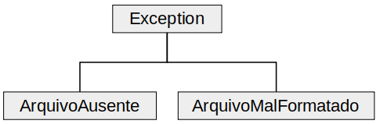

## Descrição das classes de exceção

Classe | Descrição
----- | -----
ArquivoAusente | Indica que um dos arquivos de texto ou texturas do jogo não foi localizada
ArquivoMalFormatado | Indica que um dos arquivos de texto do jogo está fora do formato padrão ou com dados faltando, o que não permite seu uso
